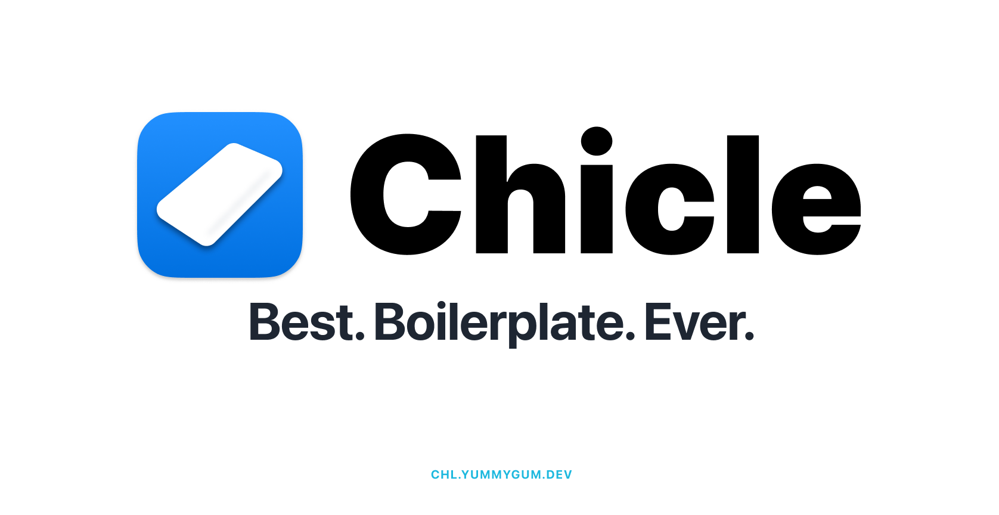

[](https://chl.yummygum.dev/storybook/)

# Chicle — Next.js boilerplate

This is Yummygum's [Next.js](https://www.nextjs.org) boilerplate. Next.js is a framework for React that will make React apps very fast. It contains Pre-Rendering, Static Exporting and much more features. Have a quick look on [the features list](https://nextjs.org/#features) to have an better overview.

This boilerplate makes it easier to get up and running for every new project.

[🔗 Storybook](https://chl.yummygum.dev/storybook/)

[🔗 Website](https://chl.yummygum.dev/)

## Codebase

### Technologies
We use [Next](https://www.nextjs.org/) (v10.0.1), in combination with [React](https://reactjs.org/) for the frontend. The styling is a mix of Sass Modules & 'regular' SCSS. To make sure our components are pixel-perfect, we use [Storybook](https://storybook.js.org/) to present different variations and check them in isolation, without all the noise.

### Folder structure
```sh
project-name/
├── .storybook # Storybook-specific files
├── public     # Public files used on the frontend
├── scripts    # node scripts
├── src        # Client
  ├── components    # Components
    ├── atoms
    ├── molecules
    └── organisms
  ├── helpers       # utils and hooks
  ├── pages         # app route pages
  └── styles        # Global styling
└── stories    # Miscellaneous Storybook files (e.g. Typography)
```

### Code Style
We've used linters for both JavaScript and (S)CSS, to make sure we write code in a consistent and well-formatted style. The settings can be found in `.eslintrc` & `.stylelintrc`. To use them, make sure you've added the right linter extensions to your preferred code editor.

### Miscellaneous packages
- Add during development

### Components
Refer to [default components list](/src/components/README.md).

### Requirements
This project recommends a Node version of `12.16.0` or higher.

## Setup
Install the packages.
```sh
npm i
# or...
yarn
```

And then run the `dev` script.

```sh
npm run dev
# or...
yarn dev
```

This will open the project on `localhost:3000`.

## Project Structure

### Pages
Next.js automatically turns React components in `src/pages/` into pages, as long as the component is made the default export. It will also look for subfolders and create nested paths based on them. Dynamic pages are called `[id].js` inside a folder, to allow for dynamic routes. The routes need an extra '/' at the end, but if you forget them, redirects are set up.

### Data
Depending on the project, we use either a headless CMS for adding content or a `src/data` folder which includes `.json` files for pages and sections.

### Styling
There's two 'types' of styling we will use: global and scoped. In both cases we're using SCSS, with a mix CSS variables. For global styling, we will be using 'plain' SCSS inside  src/styles. For scoped styling, there will be a `*.module.scss` file inside every component folder. This is to make sure we don't have to overwrite global class names inside a component, and we also don't load compiled CSS from components we don't use on the page/section itself.

### Components
We've used [Atomic Design](https://bradfrost.com/blog/post/atomic-web-design/) to sort our components and bring clarity to their utility. Components are split up into different categories: atoms, molecules & organisms, based on the human body. Organisms are a collection of molecules, molecules are a collection of atoms and atoms are the smallest parts in your body and thus your application.

There's also a fourth folder called pages. In here there's page-specific components. The pages itself are a folder above, as mentioned before.

A list of default components can be found in its [folder](./src/components/README.md).

#### Component folder
In a component folder, there's usually three files: `index.js`, `*.module.scss` and `*.stories.js`. The component function is written in `index.js`, with the styling imported, and applied to the right element(s). The `.module.scss` contains the component-specific styling, and the `.stories.js` file contains all the logic needed for the Storybook instance(s) of the component.

#### Setting up a component
When adding a component, make sure to add it to the right folder based on the Atomic Design principles. You can do it manually, or use the `new-component` script we've added.

```sh
node scripts/generate-component.js organisms Nav
# or...
npm run new-component organisms Nav
```

### Assets
All assets are added to the `public` folder. In here you'll see different subfolders based on the file type. Assets won't get compressed when building, so make sure you've compressed them before adding.

#### Next Image Component
Images use the Next [Image Component](https://nextjs.org/docs/api-reference/next/image) featured since version `10.0.0`. The Next.js Image Component, `next/image`, is an extension of the HTML `` element, evolved for the modern web.

#### SVGs
SVGs are a bit more complicated compared to other media types, because of the `Icon` component. It can be a bit confusing when a SVG should be added to the `public` folder and when it should be added as a component in atoms. This is how we decided whether it should be a component or a 'regular asset':

Icons in the `Icon` component can be:
- Used multiple times (e.g. the Watermelon logo)
- Used in 'interactive' elements (e.g. a link, button etc.)

If both aren't applicable to your item, it should be added as an asset to the `public` folder.

#### Usage in code
Files inside `public` can then be referenced by your code starting from the base URL (/). This is a built-in feature from Next, so it's preferred to not change the name of the folder.

### Storybook
The configuration of Storybook is done in the `.storybook` folder. It includes multiple [addons](https://storybook.js.org/addons/) (A11y check, light/dark mode, responsive viewport sizes and more), a custom Webpack config and a PostCSS config to automatically add prefixes to styles. The components themselves are defined in the `.stories.js` files.

Miscellaneous Storybook files that aren't components, but still need to be available can be found in the `stories` folder.

Since Next.js version `10.0.0`, Next.js has a built-in [Image Component](https://nextjs.org/docs/api-reference/next/image) and Automatic Image Optimization. Storybook won't accept this image, so we implemented a mock for this in `__mocks__/Image/index.js`.

## Usage

### Aliases
There are [Webpack](https://webpack.js.org/) aliases that allow for easy imports. In JavaScript files you can import any component, without having to think about relative paths.
```
import Button from '@/components/atoms/Button'
```

But you can also import styles or utility functions without having to worry about the folder you're currently in.

### NPM Scripts

### Convert-SVG

This script converts a single `.svg` file to a `.js` or `.tsx` react functional component with the use of [SVGR](https://react-svgr.com/).

#### How to use
This script can either be used to convert a single svg file or an entire directory. As a best practice, this directory must be **outside** of the project.

```
convert-svg ../folder-with-svgs
```

Alternatively you can target a single svg file.

```
convert-svg ../folder-with-svg/example.svg
```

This adds the svg as a `.tsx` file to the `src/components/atoms/Icon/Icons` folder. This also updates `Icon/index.tsx` to import the icon and adds it to the `icons` object. Please double check the changes made by the script and commit these changes in a separate commit.

## Commit
To commit use the underneath script, this will open up the commitizen CLI options.
```
npm run commit
```sh
# Import function
import useWindowSize from '@/hooks/useWindowSize'
```

When you add or edit these aliases, make sure that you'll edit the aliases in these files; `jsconfig.json` and `.storybook/main.js`.

### Commit
To stay consistent with our commits, we've added `git-cz` to the project. When committing, a CLI script will run with the settings based on `changelog.config.js`.
```sh
git add -A
git commit
```

### Releasing
To release a new version you have to run `standard-version`. This can be done with the release script.
```
npm run release
```
This will update the version number based on your recent commit history.

If you want to release a specific version, not based on your commits, you can add the number as an argument to the script.
```
npm run release -- --release-as 1.1.0
```

You will get version `1.1.0` rather than what would be the auto-generated version `1.0.1`.
